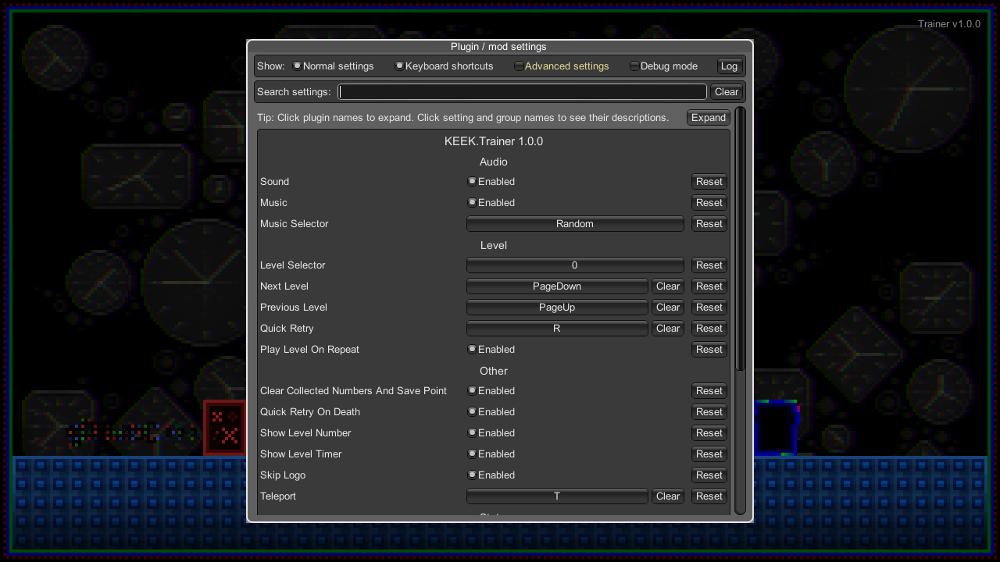
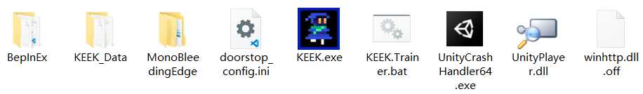
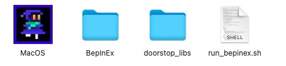

# KEEK.Trainer

KEEK.Trainer is a [BepInEx](https://github.com/BepInEx/BepInEx) plugin for practicing [KEEK](https://store.steampowered.com/app/2088080/KEEK/) speedrun.

## Features
* Level selector
* Quick retry
* Play a level on repeat
* Level timer
* Save/Load rough state
* Audio settings
* Skip logo

## How to use

1. [Download](https://github.com/DemoJameson/KEEK.Trainer/releases) the zip then unzip all files into the game folder.
2. (Windows) Run `KEEK.Trainer.bat` start the game with trainer.
3. (macOS) Launch `Terminal`, run `chmod +x run_bepinex.sh`, then run `./run_bepinex.sh` start the game with trainer.
4. Press `F1` show settings.

## Credits
* [BepInEx](https://github.com/BepInEx/BepInEx)
* [BepInEx.ConfigurationManager](https://github.com/BepInEx/BepInEx.ConfigurationManager)
* [BepInEx.ScriptEngine](https://github.com/BepInEx/BepInEx.Debug#scriptengine)
* [BepInEx.NStrip](https://github.com/BepInEx/NStrip)
